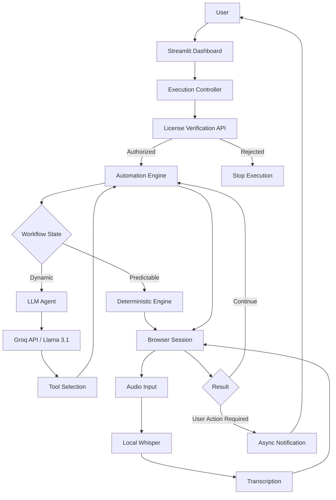
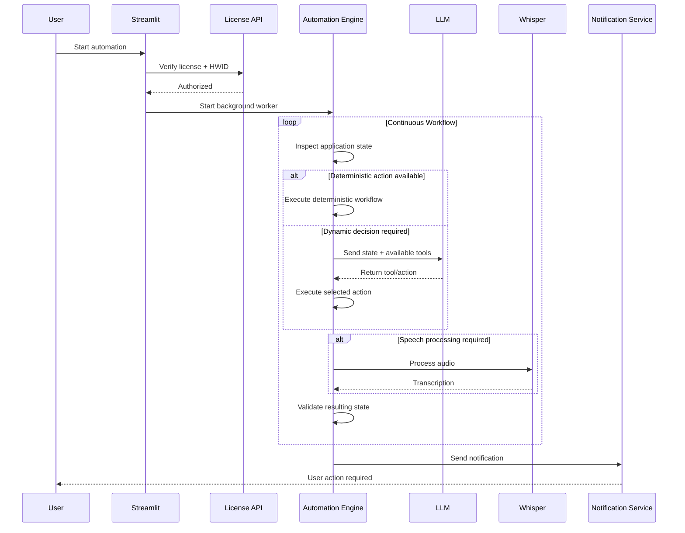

# 🤖 Production LLM Automation System

> An end-to-end Python automation platform combining **LLM tool calling, local speech-to-text, deterministic browser workflows, asynchronous notifications, REST APIs, and hardware-bound licensing** in a continuously running application.


---

## 📌 Overview

This project is a production-oriented automation system built for a real-world visa appointment workflow.

Unlike a simple chatbot or an isolated LLM demo, the system integrates an LLM into a larger software architecture containing:

- autonomous tool calling
- local speech-to-text with OpenAI Whisper
- deterministic automation workflows
- structured state transitions
- browser automation
- background processing
- REST API communication
- asynchronous notifications
- hardware-bound licensing
- persistent browser sessions
- error handling and recovery

The primary engineering challenge was not simply **calling an LLM API**.

The real challenge was deciding **where an LLM adds value and where deterministic software is safer, faster, and cheaper**.

The resulting architecture therefore uses a **hybrid deterministic + agentic approach**.

---

# 🎯 Problem

The target workflow requires repeatedly interacting with a multi-step web application, maintaining session state, processing dynamic page conditions, entering applicant information, checking availability, handling speech-based challenges, and notifying the user when manual intervention is required.

A production system for this workflow needed to:

1. run continuously for long periods
2. react to changing page states
3. recover from transient failures
4. minimize unnecessary LLM calls
5. keep latency low during repetitive operations
6. convert speech into structured actionable information
7. maintain browser state when human input is required
8. protect commercial deployments using license validation

This made the project much closer to a **production AI system** than a traditional automation script.

---

# 🧠 LLM Architecture

The application supports two execution strategies.

### 1. Deterministic Workflow

For predictable operations, the application uses normal Python control flow.

```text
Observe State
     │
     ▼
Validate Conditions
     │
     ▼
Execute Known Action
     │
     ▼
Check Result
     │
     ├── Success ──► Continue
     │
     └── Failure ──► Retry / Recover
```

This approach is used whenever the next action can be determined reliably from application state.

### 2. LLM Agent Workflow

For situations requiring dynamic action selection, the application includes an LLM-powered agent using:

**Groq API + Llama 3.1**

The model can evaluate the current state and select an appropriate tool/action.

```text
Application State
       │
       ▼
   LLM Agent
       │
       ▼
Tool Selection / Function Call
       │
       ▼
Python Execution Layer
       │
       ▼
New Application State
       │
       └────────► LLM Agent
```

The LLM is therefore **not given unrestricted control of the application**.

It operates through a defined tool/action layer while Python remains responsible for actual execution.

---

# 💡 Why Hybrid Instead of LLM-Only?

One of the most important lessons from this project was:

> **An LLM should not control something simply because it can.**

Repeated operations such as checking known page states, filling known fields, polling availability, or refreshing a workflow are better handled deterministically.

Using an LLM for every step would introduce:

- unnecessary latency
- additional API cost
- non-deterministic behavior
- more failure modes
- harder debugging

The system therefore routes predictable tasks through deterministic Python logic and reserves the LLM agent for situations where dynamic reasoning or action selection is useful.

This substantially improves **reliability, latency, and operating cost**.

---

# 🎙️ Local Speech-to-Text Pipeline

The application also integrates **OpenAI Whisper locally** for speech recognition.

Instead of sending every audio payload to an external transcription API, a Whisper model is loaded and cached locally.

Conceptually:

```text
Audio Input
    │
    ▼
Local Whisper Model
    │
    ▼
Transcription
    │
    ▼
Validation
    │
    ▼
Automation Workflow
```

Caching the model is important because repeatedly loading a speech model would introduce unnecessary initialization overhead.

Local inference also reduces dependence on an additional external API.

---

# 🏗️ System Architecture



---

# 🧩 Core Components

## `app.py`

### Streamlit UI & Execution Controller

The application dashboard is responsible for configuration and lifecycle management.

It collects:

- application credentials
- license information
- Groq API configuration
- applicant information
- target dates
- execution parameters

The automation engine runs in a background thread so long-running work does not block the Streamlit interface.

A thread-safe `queue.Queue` transfers execution logs from the worker to the UI.

```text
Automation Thread
       │
       ▼
  queue.Queue
       │
       ▼
Streamlit Log Viewer
```

This allows the application to remain responsive while the automation process continues running.

---

## `agent_core.py`

### Automation & AI Engine

This module contains the primary execution logic.

Responsibilities include:

- browser lifecycle management
- session handling
- form interaction
- application-state detection
- speech-processing integration
- availability polling
- LLM tool calling
- deterministic workflows
- notifications
- recovery logic

Two major execution paths are exposed:

```python
run_deterministic_workflow(...)
```

and

```python
run_gvc_appointment_agent(...)
```

This separation makes it possible to compare a predictable state-machine approach with an agentic LLM approach.

---

## `license_checker.py`

### Client-Side License Validation

Commercial deployments require authorization before execution.

The client generates a stable machine identifier and communicates with the remote licensing API.

Conceptually:

```text
Machine
   │
   ▼
Hardware Identifier
   │
   ▼
SHA-256
   │
   ▼
Client HWID
   │
   ▼
License Verification API
```

The identifier is used to associate an activated license with an authorized machine.

---

## `server.py`

### Flask Licensing API

A lightweight Flask backend provides centralized license verification.

The API validates:

- license existence
- activation status
- expiration
- machine binding

Example flow:

```text
POST /verify-license

        │
        ▼
Validate License
        │
        ├── Invalid ──► Reject
        │
        ▼
Check Expiration
        │
        ├── Expired ──► Reject
        │
        ▼
Check Machine Binding
        │
        ├── Mismatch ─► Reject
        │
        ▼
      Approve
```

---

# 🔄 End-to-End Workflow



---

# ⚡ Production Engineering Considerations

## Reliability

LLM output is treated as **untrusted application input**, not automatically correct behavior.

Actions are executed through predefined Python functions, allowing the surrounding software to validate state before and after execution.

---

## Latency

The LLM is intentionally kept out of high-frequency deterministic loops.

For repetitive operations:

```text
Python state machine
```

is preferred over:

```text
State → API → LLM → Response → Parse → Action
```

This reduces unnecessary network latency.

---

## Cost Control

The system minimizes model usage by using the LLM only when its reasoning capability provides meaningful value.

The architecture therefore acts as a basic form of **model routing**:

```text
Task
 │
 ├── Predictable ─────────► Python
 │
 ├── Speech Recognition ──► Local Whisper
 │
 └── Dynamic Decision ────► Llama 3.1 / Groq
```

---

## Background Processing

Long-running automation is executed outside the UI thread.

This prevents the dashboard from becoming unresponsive and allows logs and status information to continue updating while work is performed.

---

## Human-in-the-Loop

The system does not assume every stage should be fully autonomous.

When a workflow reaches a point requiring user intervention, it can:

1. preserve the active browser session
2. send an asynchronous notification
3. allow the user to complete the required action

This creates a practical **human-in-the-loop automation architecture**.

---

# 🚨 What Broke in Production?

The most valuable engineering work happened after the initial prototype worked.

A demo can follow a happy path.

A continuously running system cannot assume one.

### Dynamic Application State

The external application did not always remain in the expected state.

A rigid script could therefore attempt an action against the wrong page or UI state.

**Solution:** Explicit state checks were introduced before important operations.

---

### Long-Running UI Blocking

Running the automation directly from the Streamlit execution flow caused responsiveness problems.

**Solution:** The automation was moved to a background thread with thread-safe log communication through `queue.Queue`.

---

### Expensive Repeated Intelligence

Using an LLM for every decision increased latency and introduced unnecessary non-determinism.

**Solution:** A deterministic execution engine became the default path, while the LLM agent was retained for dynamic decisions.

---

### Model Initialization Overhead

Reloading the speech model repeatedly would make transcription unnecessarily expensive.

**Solution:** The Whisper model is cached and reused.

---

### Human Intervention

Some states require the user rather than the automation system.

Closing the browser or restarting the session at this point would destroy useful state.

**Solution:** Browser lifecycle management was designed to preserve the session while asynchronous notifications inform the user.

---

# 📊 Engineering Lessons

Building this system changed how I approach LLM applications.

### 1. The model is only one component

A production LLM application still requires conventional software engineering:

- state management
- APIs
- retries
- validation
- concurrency
- logging
- security
- error handling

### 2. Determinism is valuable

If normal code can solve a problem reliably, an LLM is often unnecessary.

### 3. Tool calling needs boundaries

LLMs are more useful when they select from controlled actions instead of directly controlling the entire application.

### 4. Production failures matter more than demos

The difficult problems appear after the happy path works:

- external state changes
- transient failures
- long-running sessions
- model latency
- malformed outputs
- network failures
- synchronization problems

### 5. Human-in-the-loop is sometimes the correct architecture

Autonomy should be used where it improves the workflow—not simply maximized.

---

# 🛠️ Technology Stack

| Area | Technology |
|---|---|
| Primary Language | Python |
| LLM | Llama 3.1 |
| LLM API | Groq |
| Speech-to-Text | OpenAI Whisper |
| API Backend | Flask |
| Frontend | Streamlit |
| Browser Automation | Selenium / ChromeDriver |
| Concurrency | Python Threading |
| Inter-thread Communication | `queue.Queue` |
| Notifications | SMTP |
| Configuration | `python-dotenv` |
| Security | SHA-256 HWID binding |

---

# 📁 Repository Structure

```text
.
├── app.py
│   └── Streamlit dashboard and execution controller
│
├── agent_core.py
│   └── Automation engine, LLM agent and speech pipeline
│
├── license_checker.py
│   └── Client-side license and HWID verification
│
├── server.py
│   └── Flask licensing backend
│
├── .env.example
│   └── Example environment configuration
│
├── requirements.txt
│   └── Python dependencies
│
└── README.md
    └── Project documentation
```

---

# ⚙️ Installation

## 1. Clone the repository

```bash
git clone <your-repository-url>
cd <repository-name>
```

## 2. Create a virtual environment

```bash
python -m venv .venv
```

Activate it on Windows:

```bash
.venv\Scripts\activate
```

Linux/macOS:

```bash
source .venv/bin/activate
```

## 3. Install dependencies

```bash
pip install -r requirements.txt
```

---

# 🔐 Environment Configuration

Create a `.env` file locally.

```env
GROQ_API_KEY=your_groq_api_key

LICENSE_KEY=your_license_key

GVC_USERNAME=your_username
GVC_PASSWORD=your_password
```

> **Never commit `.env`, API keys, passwords, cookies, private customer data, or production credentials to GitHub.**

---

# ▶️ Running the Application

Start the Streamlit dashboard:

```bash
streamlit run app.py
```

The application will initialize the dashboard and allow the automation worker to be started from the UI.

---

# 🔒 Security

The repository should never contain real production secrets.

Sensitive configuration must be supplied through environment variables or another secrets-management mechanism.

The following should remain excluded through `.gitignore`:

```gitignore
.env
*.env
__pycache__/
*.pyc
.venv/
venv/
cookies/
profiles/
*.log
licenses.json
```

---

# 🔬 Key Technical Concepts Demonstrated

This project demonstrates practical experience with:

- **LLM tool/function calling**
- **Agentic workflows**
- **Deterministic vs. LLM routing**
- **Speech-to-text pipelines**
- **Local model inference**
- **LLM integration with real software systems**
- **Python backend development**
- **REST APIs**
- **Background workers**
- **Thread-safe communication**
- **Human-in-the-loop systems**
- **Production error handling**
- **Long-running automation**
- **Latency optimization**
- **LLM cost control**
- **Application state management**
- **Commercial software licensing**

---

# 📈 Future Improvements

The architecture can be extended with:

- formal LLM evaluation datasets
- structured JSON-schema validation for tool calls
- centralized observability and tracing
- persistent job queues
- Redis-backed state management
- automated regression tests
- model routing across multiple providers
- retry policies with exponential backoff
- token and latency telemetry
- containerized deployment

A particularly valuable next step would be adding an **evaluation harness** so changes to prompts, models, and tool definitions can be measured against a fixed set of expected decisions before deployment.

---

# 👨‍💻 Author

**Muhammad Majid Ahmad**

Python Developer · AI/LLM Engineer · Data & Automation Engineer

Specialized in building production-oriented Python automation, data extraction, AI integrations, and intelligent workflow systems.

---

## ⚠️ Responsible Use

This repository is presented as an engineering portfolio project demonstrating LLM integration, speech processing, backend architecture, state management, and production automation patterns.

Users are responsible for ensuring that any automation they deploy complies with the terms, policies, authorization requirements, and applicable rules of the services with which it interacts.

---

## 📄 License

This project is shared for portfolio and demonstration purposes.

Commercial deployment, redistribution, or reuse may require separate permission.